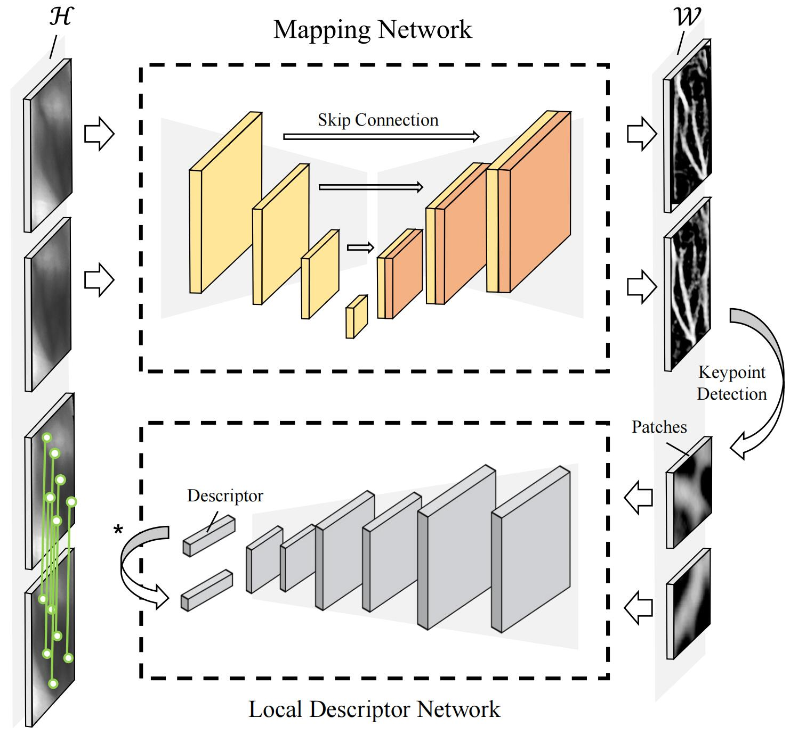

# FV-UPatches: Towards Universal Finger-Vein Recognition with Domain Transformation

[**Paper**](https://arxiv.org/pdf/2206.01061) 
| Ziyan Chen, Jiazhen Liu, Junyan Li, Changwen Cao, Changlong Jin, and Hakil Kim

<p align="center">
  
</p>

**FV-UPatches** is a two-stage framework towards generic finger vein recognition in unseen domains.
We provide the pre-trained U-Net model which can be easily transfered to other datasets without retraining or fine-tuning effort.

FV-UPatches is based on an open-set recognition settings, whose pipeline can be depicted as follows:

1. Preprocess
   - Generate meta-info of input pairs - `[[I_i1, I_j1], [I_im, I_jm], ...]`
   - Prepare segmentation maps from raw inputs based on pretrained U-Net - `I_seg = U-Net(I)`

2. Detect keypoints from segmentation maps - `kps = Detector(I_seg)`

3. Extract local descriptors from segmentation maps on keypoints - `desp = Descriptor(kps, I_seg)`

4. Compute distance of the descriptor-set pair to measure their similarity - 
`result = Matcher(desp_i, desp_j)`

✨ Please help star this repo if it is helpful for your work. Thanks! XD.

## 🚩 Upadates

* June 12, 2023 - New functions (cross-dataset evaluation) added. To use the new features, please download new *pairs_meta* data.
* Dec 13, 2022 - 🚀 this repo is created.

#### TODO
- [ ] Relase Preprocessing codes (Matlab).
- [ ] Release the soft label data 
(Since the finger-vein data require licenses to access, we may provide the processing Matlab codes as an alternative).

## 🔧 Install
```bash
# 1. Create virtual env
conda create -n fv_upatches python=3.7
conda activate fv_upatches

# 2. Follow PyTorch tutorial to install torch, torchvision (and cudatoolkit) according to your env.
# See https://pytorch.org/get-started/previous-versions/
# e.g. for cu10.2
conda install pytorch==1.5.0 torchvision==0.6.0 cudatoolkit=10.2 -c pytorch

# 3. Install additional dependencies
pip install -r requirements.txt
```

### Models & Data

#### Model Zoo

|            U-Net            |        SOSNet        | TFeat|
|:---------------------------:|:--------------------:|:---:|
| [**unet-thu.pth**](https://drive.google.com/file/d/1NDJuzo6SpIIYCfdMlWosJSvaCsPZRicW/view?usp=share_link) | [**32×32-liberty.pth**](https://github.com/scape-research/SOSNet/blob/master/sosnet-weights/sosnet-32x32-liberty.pth) | [**tfeat-liberty.params**](https://github.com/vbalnt/tfeat/blob/master/pretrained-models/tfeat-liberty.params)|

All weights file should be placed in the directory of `models/weights/`.
You can use the provided models from the above links, or train your custom models.

The above-mentioned weight files can be downloaded in [**Baidu Cloud**](https://pan.baidu.com/s/1DsOx1rHZuUROQLm-EleFhQ?pwd=srqu) as well.

```bash
# exec in your proj root directory
bash ./models/download_weights.sh
```

#### Data
Restricted by licenses of the public finger-vein datasets, we provide only 10 samples of three datasets to show how the pipeline works.
Download from [**Google Drive**](https://drive.google.com/drive/folders/1DmJAnlWKMup1ti9UBTZgA6qKEW6Ehtsk?usp=sharing) | [**Baidu Cloud**](https://pan.baidu.com/s/1md6Fiv6AQLD2PsCZtekthA?pwd=bkfn).


#### File Tree
A model (weights) and data file tree can be like this:
```bash
├── ...
├── models
    ├── sosnet
    ├── unet
    └── weights
└── data
    ├── pairs_meta
    ├── config.yaml
    ├── ...
    ├── MMCBNU
    ├── FVUSM
    └── SDUMLA
        ├── roi
        ├── seg      # pseudo segmentation labels based on traditional methods
        ├── seg-thu   # segmentation from U-Net trained in THU-FV dataset
        └── thi       # skeleton(thinning images) as the keypoint priors
```
You have to provide the segmented data. The demo file tree shows segmentation data from U-Net as `seg-thu` and from traditional methods as `enh`.

## 💻 Eval

You can eval FVR(Finger-Vein Recognition) performance based on an open-set setting in any datasets.

```bash
# exec in the proj root directory

# e.g. eval in SDUMLA based on FVC protocol and <Ridge Det+SOSNet Desp>
python eval.py -d ./data/SDUMLA -p ./data/pair/SDUMLA-FVC.txt -s ./results -desp SOSNet -det RidgeDet 

# see descriptions of the arguments
python eval.py -h
```

To evaluate pretrained U-Net, prepare the enhanced finger vein data as the input and execute the script:

```bash
# 1.download unet-xx.pth firstly in models/unet/weights
cd models/unet
# 2.
python eval.py -s ./outputs/MMCBNU
```


### Supported Baseline

We also provide the implementation of the baseline.

| Detector | Descriptor |
|:---:|:---:|
| RidgeDet (Skeleton) | SOSNet、TFeat |
| - | SURF、SIFT、FAST |

An example to run baselines.
```bash
# e.g. eval in SDUMLA based on FVC protocol(default args) and <SIFT det+desp>
python eval.py -desp SIFT -det None
```

## ⚡ Train
You can train a U-Net model on your custom data(including the grascale ROI finger images and labels). The default input size is `[128, 256]`.
```bash
cd models/unet

# cd target dir
python split_data.py
# see help of the arguments
# python split_data.py -h

python train.py
```

## 📜 Acknowlegements

* **Dataset** -
    [**MMCBNU**](https://www.researchgate.net/profile/Yu-Lu-16/publication/271552773_An_available_database_for_the_research_of_finger_vein_recognition/links/54d9f8ba0cf2970e4e7d4188)
  | [**HKPU**](https://www.researchgate.net/profile/Yingbo-Zhou/publication/51715256_Human_Identification_Using_Finger_Images/links/542d6af80cf27e39fa942bf1/Human-Identification-Using-Finger-Images.pdf)
  | [**UTFVP**](https://ieeexplore.ieee.org/abstract/document/6743955)
  | [**SDUMLA**](https://www.researchgate.net/profile/Lili-Liu-7/publication/221141502_Lecture_Notes_in_Computer_Science/links/09e4150631126c043f000000/Lecture-Notes-in-Computer-Science.pdf)
  | [**FVUSM**](https://www.sciencedirect.com/science/article/abs/pii/S0957417413009536)
  | [**THU-FV**](https://www.sigs.tsinghua.edu.cn/labs/vipl/thu-fvfdt.html)
* **SOSNet** - 
    [**Project Page**](https://research.scape.io/sosnet/)
  | [**Paper**](https://arxiv.org/abs/1904.05019)
  | [**Source Code**](https://github.com/scape-research/SOSNet)
* **U-Net** - 
    [**Paper**](https://arxiv.org/abs/1505.04597)
  | [**PyTorch Implementation**](https://github.com/nikhilroxtomar/Retina-Blood-Vessel-Segmentation-in-PyTorch)

## 📧 Contact
If you have any question of this work, please feel free to reach me out at [chen.ziyan@outlook.com](chen.ziyan@outlook.com).

For business or other formal purposes, please contact **Prof. King** at [cljin@sdu.edu.cn](cljin@sdu.edu.cn).

